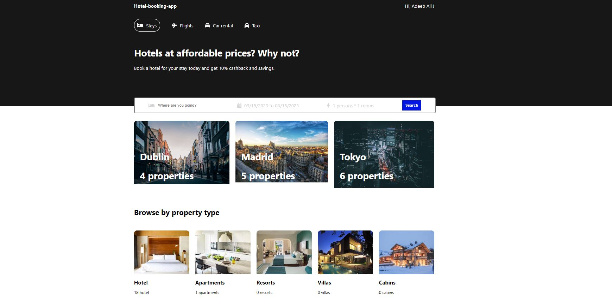

# Simple Hotel Booking App using MERN stack.
This project is inspired by Lama Dev's YouTube videos "React Booking | Reservation App UI Design for Beginners" and "React Node.js Booking App Full Tutorial | MERN Stack Reservation App (JWT, Cookies, Context API)". The links for the YouTube videos are:

1. "React Booking | Reservation App UI Design for Beginners" by Lama Dev.
    https://www.youtube.com/watch?v=RkWpJ4XUHuw

2. "React Node.js Booking App Full Tutorial | MERN Stack Reservation App (JWT, Cookies, Context API)" by Lama Dev.
    https://www.youtube.com/watch?v=k3Vfj-e1Ma4

This project is created using the MERN stack- MongoDB, Express js, React js and Node js. This project is a simple hotel booking/reservation app that allows users to book/reserve hotels. 

The detailed use of the MERN stack for this project is as follows:
1. MongoDB- It is used as a database for this project to store all the details.
2. Express.js and Node.js- Used for creating backend APIs.
3. React- Used for the frontend of the application.

### Future improvements
1. Adding a complete hotel reservation checkout functionality.
2. Better and more secure user authorization functionality.
3. Better hotel/ destination recommendation system.

